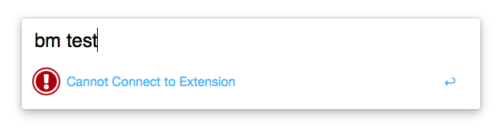
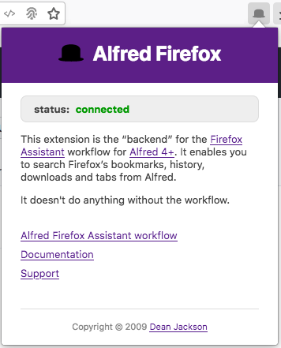
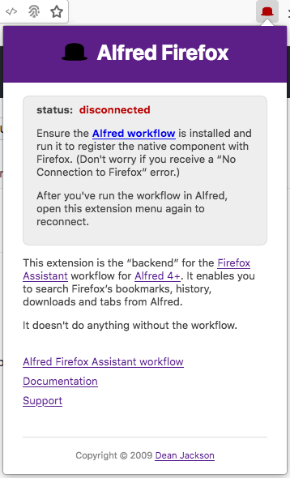
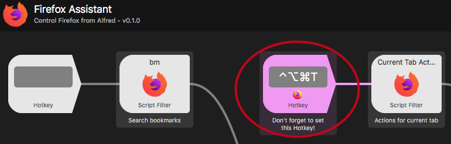
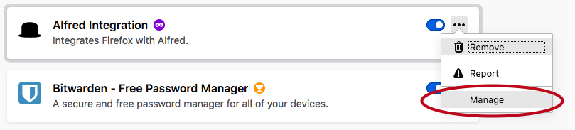

Setup
=====

Unfortunately, this workflow requires a slightly complex setup :(

Due to Firefox's egregious lack of support for AppleScript, the workflow needs to install a browser extension to communicate with Firefox.

Setup is easier if you install [the workflow][workflow] first, and then the [browser extension][addon].

The extension supports (at least) Firefox, Firefox Nightly and Firefox Developer Edition, but please note that it can only connect to one browser at a time.

If you open a second Firefox, the first will be disconnected. Click on the extension icon to reconnect that browser (and disconnect others).

<!-- vim-markdown-toc GFM -->

* [Installation](#installation)
  * [Catalina](#catalina)
* [Setup](#setup)
  * [Don't forget!](#dont-forget)

<!-- vim-markdown-toc -->

Installation
------------

1. Download and install the workflow from [GitHub][workflow]
2. Run `ffass` in Alfred and choose `Install Firefox Extension` to install the [Firefox extension][addon].

### Catalina ###

If you're running Catalina, it will likely gripe about the `alfred-firefox` binary being unsigned and refuse to run it.

[See here for instructions for how to fix it][catalina].

Setup
-----

If you install and run the workflow first, everything should be set up for the extension to work correctly. At this point, you may see the following error, but this is expected:

The workflow has installed the native-application manifest, and will connect to Firefox as soon as the extension is installed. Once you've installed the extension, you should see the following when you click on its icon:

If you've installed the browser extension before you've run the workflow, you'll see the following error because Firefox doesn't know where to find the workflow:

Now you need to install the workflow, run it, and then click on the extension's icon again to cause it to try to reconnect to the native application. After a second or so, the extension should indicate that it's connected to the workflow:

At this point, you should be able to search Firefox's bookmarks, history, downloads and tabs from Alfred.

### Don't forget!

1. You should set a Hotkey for the "Current Tab Actions" Script Filter to get quick access to actions for the active tab.

  

2. You have to allow the workflow to run in private windows to use the "Open in Incognito Window" action. If you didn't allow this on installation, you can grant the permission later by going to `about:addons` and clicking the workflow's "Manage" button. Then select "Run in Private Windows: Allow".

  

---

[^ Documentation index](index.md)

[workflow]: https://github.com/deanishe/alfred-firefox/releases/latest
[addon]: https://addons.mozilla.org/en-US/firefox/addon/alfred-launcher-integration/
[catalina]: https://github.com/deanishe/awgo/wiki/Catalina
