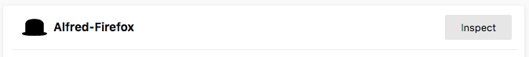

Troubleshooting
===============

If the workflow isn't connecting to the extension, first try this:

1. Run `ffass` > `Register Workflow with Firefox` in Alfred to re-install the native app manifest (which tells Firefox where to find the workflow).
2. Open the extension's popup in Firefox, which causes the extension to try to restart the native client.

If that doesn't work, check the workflow's log files and Firefox's extension debugger for error messages.


Log files
---------

The workflow writes two log files, both stored in the workflow's cache directory. Open the cache directory by entering `ffass workflow:cache` into Alfred.

- `net.deanishe.alfred.firefox-assistant.log` — Log written by the Alfred workflow.
- `net.deanishe.alfred.firefox-assistant.server.log` — Log written by the extension client/workflow RPC server that connects the workflow with Firefox.


Firefox extension debugger
--------------------------

The extension logs messages and errors to console in Firefox's extension debugger. To open the debugger, open the following URL in Firefox:

```
about:devtools-toolbox?type=extension&id=alfredfirefox%40deanishe.net
```

This is equivalent to opening the `about:debugging` screen and clicking the extension's `Inspect` button:




File an issue
-------------

If none of that helps, please file an issue on [the workflow's issue tracker][issues].

---

[^ Documentation index](index.md).

[issues]: https://github.com/deanishe/alfred-firefox/issues
